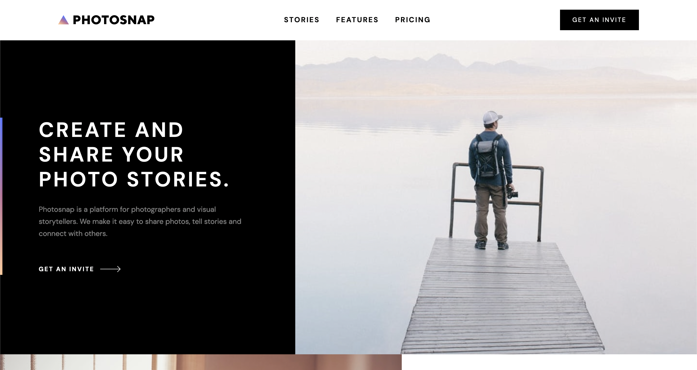

# Frontend Mentor - Photosnap multi-page website solution

This is a solution to the [Photosnap multi-page website challenge](https://www.frontendmentor.io/challenges/photosnap-multipage-website-nMDSrNmNW) on Frontend Mentor

## Table of contents

-  [Overview](#overview)
   -  [The challenge](#the-challenge)
   -  [Screenshot](#screenshot)
   -  [Links](#links)
-  [My process](#my-process)
   -  [Built with](#built-with)
   -  [What I learned](#what-i-learned)
   -  [Continued development](#continued-development)
   -  [Useful resources](#useful-resources)
-  [Author](#author)

## Overview

### The challenge

Your users should be able to:

-  View the optimal layout for each page depending on their device's screen size
-  See hover states for all interactive elements throughout the site

### Screenshot



### Links

-  Live Site URL:

## My process

### Built with

-  Semantic HTML5 markup
-  CSS custom properties
-  Flexbox
-  CSS Grid
-  Mobile-first workflow
-  Sass - CSS preprocessor
-  Typescript

### What I learned

```html
<table>
   <caption class="sr-only">
      Compare pricing features
   </caption>
   <thead>
      <tr>
         <th id="feat" scope="col">The Features</th>
      </tr>
   </thead>
   <tbody>
      <td headers="basic">
         
         <p class="sr-only">Feature available</p>
      </td>
   </tbody>
</table>
```

Table - first time building + styling tables in a project | accessible - caption even though not visible in design, headers + scope attrs, description of whether feature available (only tick SVG - wouldn't make sense to include in alt)

```scss
$colors: (
   accent-orange: 28 100% 79%,
);
```

Naked HSL colour format - alpha easily changeable (different shades of grey - table borders, colour of body vs btn hover effects)

```scss
.hamburger {
   &[data-visible='true'] {
      &::before {
         transform: rotate(46deg) translate(9px, 2.5px);
      }
      &::after {
         transform: rotate(-46deg) translate(3px, 3px);
      }
   }
}
```

Hamburger - creating manually with spans + pseudo els of parent button | translate lines to form a cross on click

```scss
.grid-container {
   @include m(offset) {
      @include m(pm) {
         @include mq(min-width, tablet) {
            grid-template-columns: 1fr auto;
         }
         @include mq(min-width, desktop-offset) {
            grid-template-columns: minmax(500px, 1fr) auto;
         }
         @include mq(min-width, ultra-wide) {
            grid-template-columns: repeat(2, 1fr);
         }
      }

      @include mq(min-width, desktop-offset) {
         @include e(image) {
            opacity: 0;
         }
         @include m(hero) {
            @include m(home) {
               @include bg-img(
                  $img: '../assets/home/desktop/create-and-share.jpg'
               );
            }
         }
      }
   }
}
```

Grid offset design - switching fluid imgs + background-imgs (cover space where padding on text items causes fluid grid rows to expand) | changing position to keep focus point of img in view (diff for each pic)

```scss
.hero {
   @include mq(min-width, tablet) {
      padding-left: clamp(2rem, 6vw, 5rem);
   }
}
```

Accent bar - repsonsive height to hero content but pinned to viewport edge | logical clamp() padding-left = scale with width of utility container-wrapper + adjusted for ultra wide screens

```scss
.hero {
   @include m(stories) {
      @include mq(min-width, tablet) {
         background-color: transparent;
         position: relative;
         grid-column: 1 / 2;
         grid-row: 1 / 2;

         @include m(bg) {
            grid-column: 1 / -1;
            grid-row: 1 / 2;
         }
      }
   }
}
```

Overlapping content with grid (referenced kevins vid below)

```scss
.social-list {
   @include e(item) {
      position: relative;
      @include p-el(before) {
         @include position(absolute);
      }
      &:hover {
         @include p-el(before) {
            opacity: 0;
         }
      }
   }
}
```

Social icons - gradient fill achieved by displaying that version on top of default as pseudo-el (opacity switched on hover)

### Continued development

Sass partials - more organised (Kevin live stream) - utilities folder + additional abstract partials (maps broken up)

### Useful resources

-  [Easily overlap content with CSS Grid](https://www.youtube.com/watch?v=HFG3BKOqOlE&ab_channel=KevinPowell) - Kevin's video for grid section in footer (overlapping nav + grid rows responding based on that)

-  [Build and deploy your portfolio](https://scrimba.com/learn/portfolio) - Scrimba course with Kevin showcases custom animated harmburger

## Author

-  Website - [Joshua Jameson-Wallis](https://joshuajamesonwallis.com)
-  Linkedin - [Joshua Jameson-Wallis]()

```scss

```
